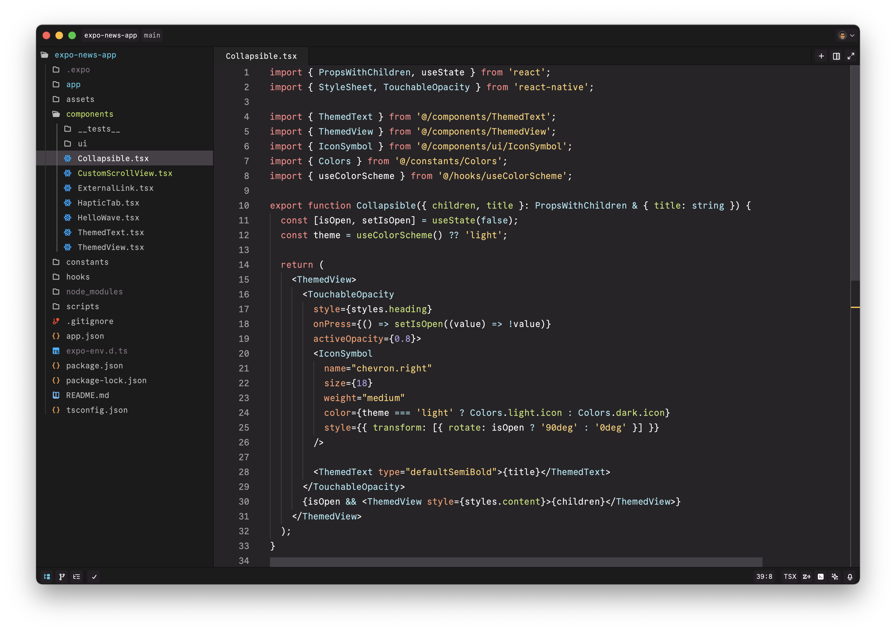

# 0x96f theme for Zed

A simple and pleasant dark theme for [Zed](https://zed.dev).

## Screenshots

## Manual install

- Copy the `themes/*.json` files from this repo into `~/.config/zed/themes`.
- Select your theme (Settings -> Select Theme).
